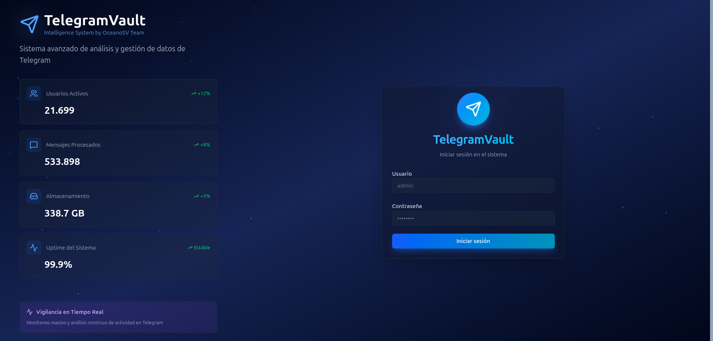
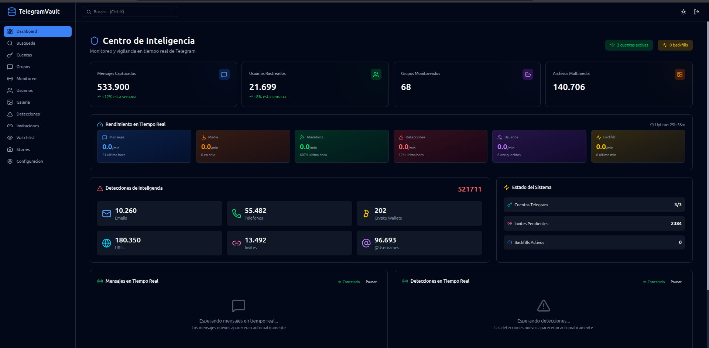

# TelegramVault


<p align="center">
  <b>Plataforma moderna para capturar, organizar y explorar información de Telegram</b><br/>
  <sub>FastAPI + Telethon + React (Vite) + Docker</sub>
</p>

### Login


### Dashboard


<p align="center">
  <!-- Badges -->
  
  
  
  
  
</p>

---

## 📌 ¿Qué es TelegramVault?

**TelegramVault** es una plataforma para **capturar, almacenar, organizar y explorar** datos de Telegram (chats, canales, grupos y medios) usando una sesión autenticada.

El objetivo es tener un **“vault” local** que te permita:

- Descargar y organizar medios (fotos, videos, documentos)
- Explorar mensajes desde una interfaz web
- Hacer búsquedas rápidas y filtros
- Mantener configuración y logging centralizados
- Trabajar en modo **dev** o **dockerizado**


---

## ✨ Características

- 🔐 **Sesión Telegram** con Telethon
- ⚡ **API** con FastAPI
- 🧠 Configuración centralizada (ConfigManager)
- 🧾 Logging estructurado (fácil de depurar)
- 🖥️ Frontend moderno (React + Vite)
- 🐳 Deploy simple con Docker Compose
- 📦 Organización de medios descargados
- 🧩 Estructura modular para agregar scrapers y módulos OSINT

---

## 🧱 Arquitectura (alto nivel)

```
Telegram (API)
   │
   │  Telethon (sesión)
   ▼
Backend (FastAPI)  ───► DB / Storage / Media
   │
   │ REST API
   ▼
Frontend (React/Vite)
```


## 🧰 Requisitos

### Opción A: Docker (recomendado)

- Docker
- Docker Compose

### Opción B: Desarrollo local

- Python 3.10+
- Node.js 18+
- npm / pnpm

---

## 🐳 Instalación (Docker)

### 1) Clonar

```bash
git clone https://github.com/TU_USUARIO/telegramvault.git
cd telegramvault
```

### 2) Configurar variables

```bash
cp .env.example .env
nano .env
```

Ejemplo mínimo:

```env
TELEGRAM_API_ID=12345678
TELEGRAM_API_HASH=tu_hash_aqui
SECRET_KEY=genera_un_string_aleatorio
```

Generar `SECRET_KEY`:

```bash
python3 -c "import secrets; print(secrets.token_urlsafe(32))"
```

### 3) Levantar stack

```bash
docker compose up -d --build
```

### 4) Ver logs

```bash
docker compose logs -f
```

### 5) Abrir servicios

- Frontend: `http://localhost:5173`
- API: `http://localhost:8000`

> Los puertos exactos pueden variar según tu `docker-compose.yml`.

---

## 🧪 Desarrollo local (sin Docker)

### Backend

```bash
cd backend
python3 -m venv .venv
source .venv/bin/activate
pip install -r requirements.txt
uvicorn app.main:app --reload --host 0.0.0.0 --port 8000
```

### Frontend

```bash
cd client
npm install
npm run dev
```


## 📁 Estructura del proyecto

```
telegramvault/
  backend/              # API + Telethon + extracción
  client/               # React/Vite
  docs/                 # documentación
  scripts/              # helpers / utilidades
  docker-compose.yml
  .env.example
```


## 🧯 Troubleshooting

### Error: “API_ID / API_HASH invalid”
Revisa que:

- Tus credenciales vienen de https://my.telegram.org
- No estés usando valores vacíos en `.env`

### Error: “2FA required”
Si tu cuenta tiene 2FA, TelegramVault te pedirá la contraseña.


## 🤝 Contribuir

PRs y sugerencias son bienvenidas.

Si vas a contribuir:

1. Crea un fork
2. Crea una rama (`feature/...`)
3. Abre un PR

---
